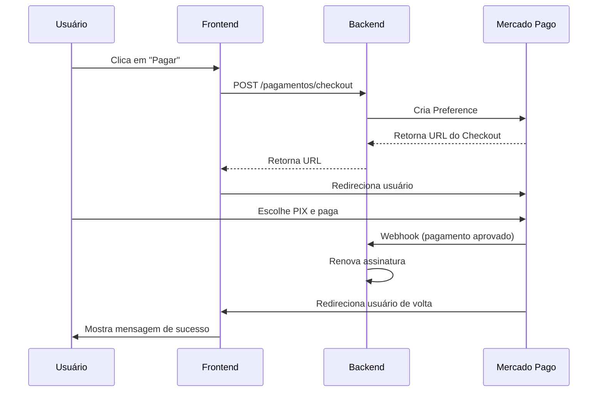

# 🚀 Guia Rápido - Pagamento via PIX

## ✅ O que foi implementado

Agora os restaurantes podem renovar a assinatura usando:
- 💰 **PIX** (pagamento instantâneo)
- 📄 **Boleto Bancário**
- 💳 **Cartão de Crédito**

Tudo através do checkout seguro do Mercado Pago!

## 🎯 Como usar (Administrador do Restaurante)

### 1. Acesse a página de assinatura
```
https://seu-dominio.com/admin/assinatura
```

### 2. Escolha um plano
Você verá 3 opções:

| Plano | Valor | Economia |
|-------|-------|----------|
| **Mensal** | R$ 50,00/mês | - |
| **Trimestral** ⭐ | R$ 135,00 (3 meses) | 10% |
| **Anual** | R$ 480,00 (12 meses) | 20% |

### 3. Clique em "Pagar com PIX, Boleto ou Cartão"

### 4. Você será redirecionado para o checkout do Mercado Pago

### 5. Escolha a forma de pagamento
- **PIX**: Escaneia o QR Code e paga na hora
- **Boleto**: Gera o boleto para pagar no banco
- **Cartão**: Preenche os dados do cartão

### 6. Confirme o pagamento

### 7. Sua assinatura será renovada automaticamente! 🎉

## 🔄 Como funciona nos bastidores



## 📱 Pagamento via PIX - Passo a Passo

### Para o usuário final:

1. **Clica no botão de pagamento**
   - Sistema cria um checkout no Mercado Pago
   
2. **É redirecionado para o Mercado Pago**
   - Página segura do Mercado Pago
   
3. **Escolhe "PIX" como forma de pagamento**
   - Vê um QR Code na tela
   
4. **Abre o app do banco**
   - Escaneia o QR Code ou copia o código PIX
   
5. **Confirma o pagamento no app**
   - Pagamento é processado instantaneamente
   
6. **Mercado Pago notifica nosso sistema**
   - Via webhook (notificação automática)
   
7. **Sistema renova a assinatura automaticamente**
   - Usuário pode continuar usando o sistema
   
8. **É redirecionado de volta para nosso site**
   - Vê mensagem de sucesso

## 🔧 Configuração Técnica (Desenvolvedor)

### Variáveis de Ambiente

#### Backend (.env)
```bash
MERCADO_PAGO_ACCESS_TOKEN=seu_access_token
MERCADO_PAGO_WEBHOOK_URL=https://seu-dominio.com/api/webhooks/mercadopago
MERCADO_PAGO_WEBHOOK_SECRET=sua_secret_key
API_BASE_URL=https://seu-dominio.com/api
FRONTEND_URL=https://seu-dominio.com
```

#### Frontend
Não precisa de nenhuma configuração especial! 🎉

### Webhook Configurado

O webhook já está configurado no Mercado Pago:
- **URL Produção**: `https://garcomagil.com/api/webhooks/mercadopago`
- **URL Sandbox**: `https://e7d4d30dd816.ngrok-free.app/webhooks/mercadopago`
- **Tópico**: `payment`

### Endpoints Criados

```typescript
// Cria checkout (preference)
POST /pagamentos/checkout
Body: { planDurationMonths: 1 | 3 | 12 }
Response: { 
  preferenceId: string,
  initPoint: string, // URL do checkout
  sandboxInitPoint: string 
}

// Webhook do Mercado Pago
POST /webhooks/mercadopago
Headers: x-signature, x-request-id
Body: { type: "payment", data: { id: "12345" } }
```

## 🧪 Testando

### Ambiente de Testes (Sandbox)

1. **Use credenciais de teste do Mercado Pago**
   - Access Token de teste
   - Usuário de teste

2. **Para testar PIX:**
   ```
   Use o QR Code gerado no checkout de teste
   O pagamento será aprovado automaticamente após alguns segundos
   ```

3. **Para testar Cartão:**
   ```
   Número: 5031 4332 1540 6351
   Nome: APRO (para aprovar)
   CVV: 123
   Validade: 11/25
   ```

### Verificar Webhooks

```bash
# Ver histórico de notificações
curl -X GET https://api.mercadopago.com/v1/webhooks \
  -H "Authorization: Bearer YOUR_ACCESS_TOKEN"

# Simular webhook
curl -X POST http://localhost:3000/webhooks/mercadopago \
  -H "Content-Type: application/json" \
  -d '{
    "type": "payment",
    "data": { "id": "1234567890" },
    "live_mode": false
  }'
```

## 📊 Monitoramento

### Ver status dos webhooks
Os webhooks são salvos na tabela `WebhookEvent`:
```sql
SELECT * FROM "WebhookEvent" 
ORDER BY "createdAt" DESC 
LIMIT 10;
```

### Ver pagamentos
```sql
SELECT * FROM "Pagamento" 
WHERE "restauranteId" = 'seu-id' 
ORDER BY "createdAt" DESC;
```

## 🐛 Problemas Comuns

### Webhook não está funcionando
1. Verifique se a URL está acessível publicamente
2. Confirme que o endpoint retorna 200/201
3. Veja os logs do backend

### Pagamento não atualiza a assinatura
1. Verifique se o webhook foi recebido
2. Confirme que o `external_reference` está correto
3. Veja os logs do processamento do webhook

### Erro ao criar checkout
1. Confirme que o `MERCADO_PAGO_ACCESS_TOKEN` está correto
2. Verifique se o restaurante tem `billingEmail` configurado
3. Veja os logs do backend

## 📚 Referências

- [Mercado Pago - Checkout Pro](https://www.mercadopago.com.br/developers/pt/docs/checkout-pro/landing)
- [Mercado Pago - PIX](https://www.mercadopago.com.br/developers/pt/docs/checkout-api/integration-configuration/integrate-with-pix)
- [Webhooks do Mercado Pago](https://www.mercadopago.com.br/developers/pt/docs/your-integrations/notifications/webhooks)

## 💡 Dicas

- **PIX é instantâneo**: O pagamento é confirmado em segundos
- **Boleto demora**: Pode levar até 3 dias úteis
- **Webhook é essencial**: Sem ele, não conseguimos atualizar a assinatura automaticamente
- **Teste sempre no sandbox**: Antes de usar em produção

## 🎉 Resultado Final

Agora seu sistema aceita **múltiplas formas de pagamento** de maneira **segura** e **profissional**!

Os usuários podem escolher a forma que preferem:
- ✅ PIX para pagamento instantâneo
- ✅ Boleto se não tiverem conta digital
- ✅ Cartão de crédito parcelado

E tudo é processado **automaticamente** via webhook! 🚀
